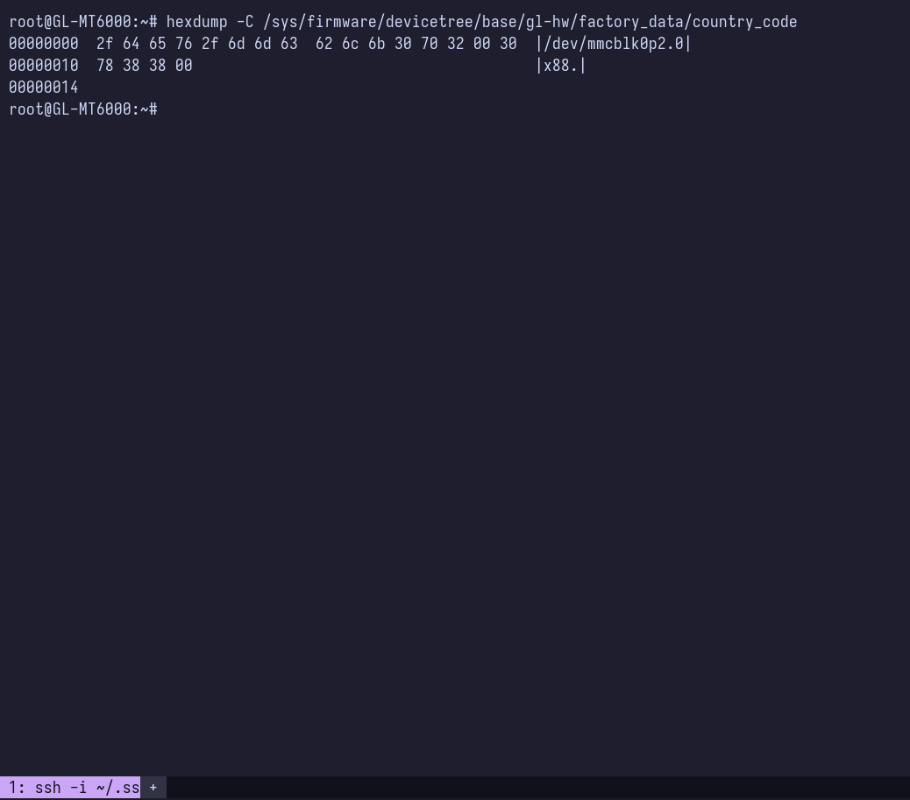
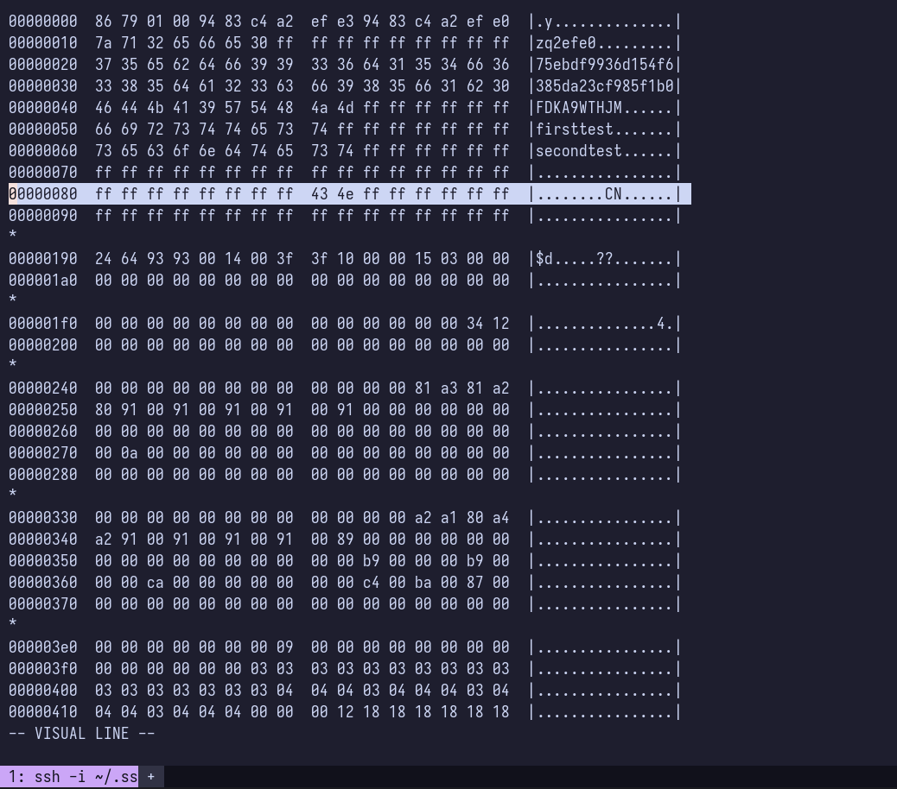
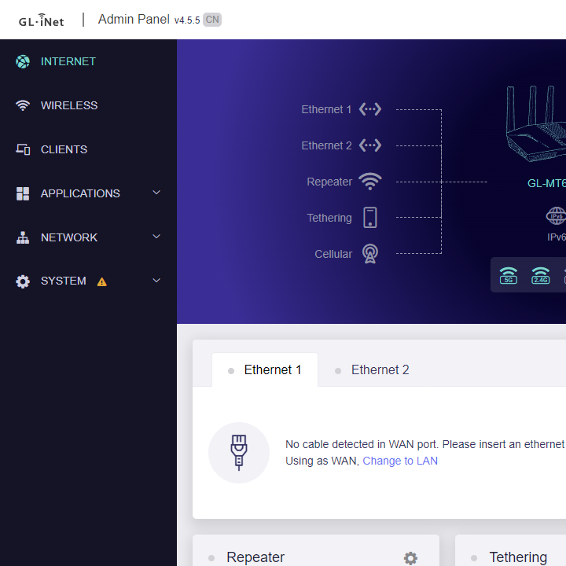
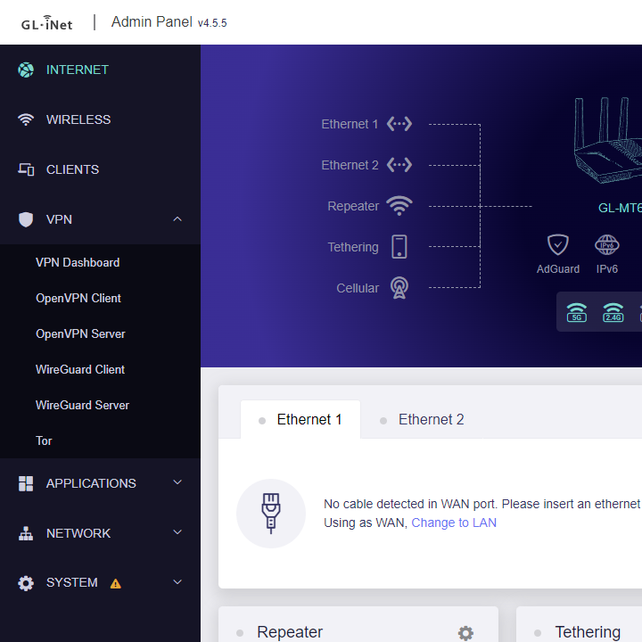

+++
title = "Convert GL.iNet GL-MT6000 Flint 2 router version from China to Global"
date = 2024-03-11
draft = false
[taxonomies]
tags = ["homelab"]
+++

## Motivation

<!-- TODO: motivation -->

As I'm looking a replacement for my now-EOL RT-AX56U, I found Flint 2 and
immediately tempted for it particularly because of it's OpenWRT support (it's
firmware is based on OpenWRT anyway) which allows endless tinkering
possibilities. Out of my curiosity, I found the price on their Taobao store is
much less (~100 USD) compared to their [global
store](https://store.gl-inet.com/) (~160 USD, although it comes with free
shipping). However even with shipping cost added (I need to use third party
forwarder as there is no direct shipping to my country) it would still a bit
cheaper if I buy from Taobao.

One limitation is that any GL.iNet devices sold on their Taobao store are "CN"
version which have their VPN section in Admin Panel hidden. This is done to
comply with local regulation.

Fortunately, there is a
[guide](https://forum.openwrt.org/t/converting-gl-inet-mt3000-beryl-ax-from-cn-to-global/165159)
to convert GL.iNet routers to Global version. This router version is determined
by `country_code` flag stored in eMMC that will be read by the Admin Panel app.
This post is mostly inspired from that guide, but I will add some additional
context based on my findings with Flint 2.

## Prerequisite

1. Enable SSH. In addition it's recommended to use public key auth which has
   been explained in [OpenWRT docs](https://openwrt.org/docs/guide-quick-start/sshadministration).

## Step

<!-- TODO: -->

1. The `country_code` flag location varies between router model. We can get the
   location for our router by getting the info from router's `devicetree`, in
   `factory_data` directory.

   ```sh
   hexdump -C /sys/firmware/devicetree/base/gl-hw/factory_data/country_code
   ```

   - line 1 (`0x00` - `0xff`): partition that stores `country_code`
   - line 2 (`0x10` - `0x13`): byte offset of `country_code` in the partition

   

   For this case it's `/dev/mmcblk0p2` with `x88` byte offset.

2. Check the partition based on step 1 result. As it contains hundreds of lines,
   it's recommended to pipe the output to a pager or text editor. Here we use
   `vim`.

   ```sh
   hexdump -C /dev/mmcblk0p2 | vim -
   ```

   Check according to the byte offset from step 1 result.

   

   As we could see currently it's `CN`. We may proceed to update the country code.

3. Update the country code. Adjust the command based on step 1 result.

   ```sh
   echo "US" | dd of=/dev/mmcblk0p2 bs=1 seek=136
   sync
   reboot
   ```

   - `bs=1`: write 1 byte at a time (default is 512 and it would be an issue for
     our case)
   - `seek=136`: `0x88` converted to decimal = 136

4. If success, the Admin Panel should no longer shows `CN` badge and VPN section
   will now appear.

   

   
