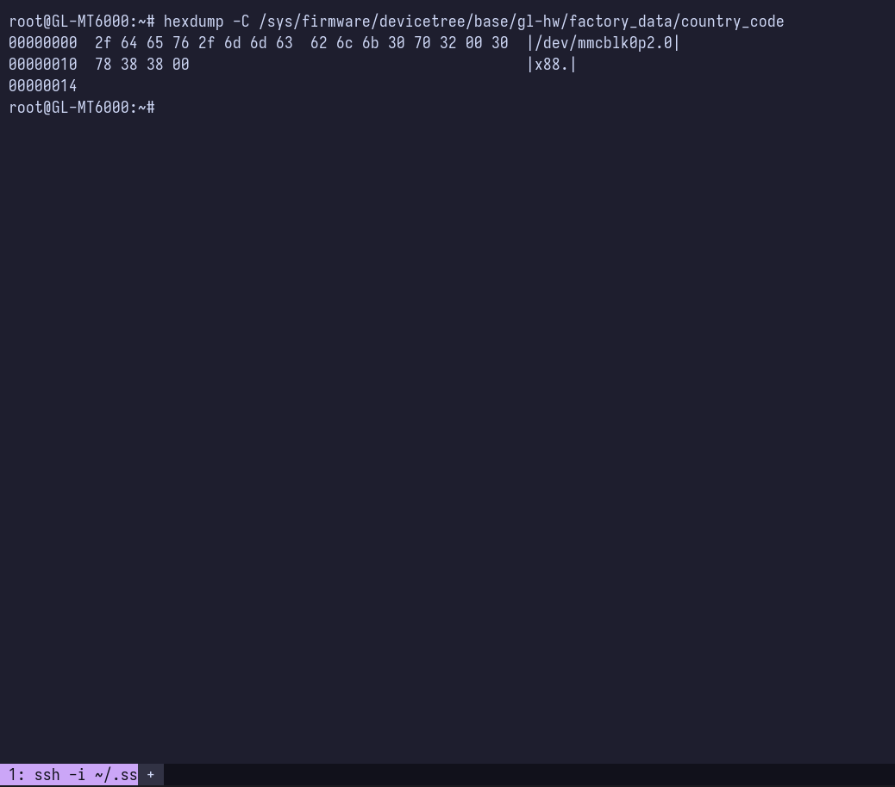
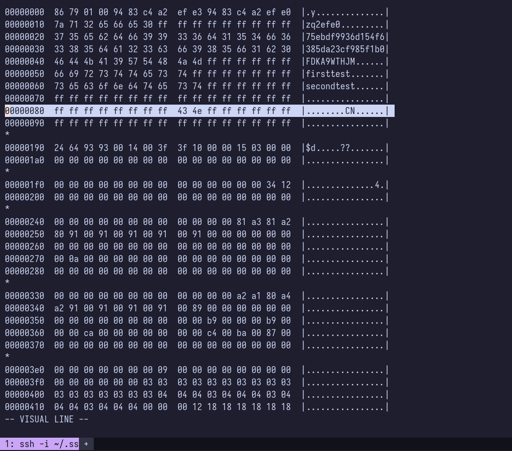
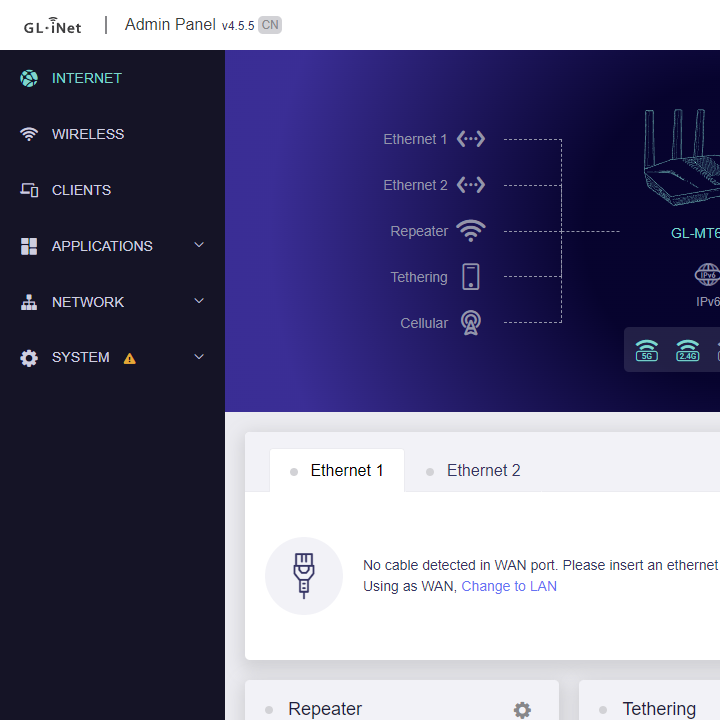
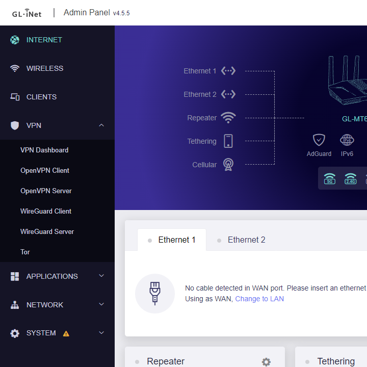

+++
title = "Unlock GL-MT6000 Flint 2 CN Restriction"
date = 2024-03-11
draft = false
[taxonomies]
tags = ["homelab", "openwrt", "router"]
+++

## Flint 2 CN?

As I'm looking a replacement for my now-EOL RT-AX56U, I found Flint 2 and
immediately tempted for it particularly because of it's OpenWrt support (it's
firmware is based on OpenWrt) which allows endless tinkering possibilities. Out
of my curiosity, I found the price on their Taobao store is much less (~100 USD)
compared to their [global store](https://store.gl-inet.com/) (~160 USD, although
it comes with free shipping). However even with shipping cost added (as I need
to use third party forwarder as there is no direct shipping to my country) it's
still a bit cheaper if I buy from Taobao.

One limitation is that any GL.iNet devices sold on their Taobao store are
China/CN version which have their VPN section in Admin Panel hidden. This is
done to comply with local regulation.

Fortunately, there is a
[guide](https://forum.openwrt.org/t/converting-gl-inet-mt3000-beryl-ax-from-cn-to-global/165159)
to convert GL.iNet routers to Global version. This router version is determined
by `country_code` variable stored in eMMC that will be read by the Admin Panel
app. This post is mostly inspired from that guide, but I will add some
additional context based on my findings with Flint 2.

## Let's Cook

### Preparation

Before we start, please enable the router's SSH. In addition it's recommended to
use public key auth which is explained more in [OpenWrt
docs](https://openwrt.org/docs/guide-quick-start/sshadministration).

### Check where the required variable is stored

The `country_code` variable may stored differently between router model. To
check where the `country_code` variable is stored, we can get the data from
router's `devicetree`.

```sh
hexdump -C /sys/firmware/devicetree/base/gl-hw/factory_data/country_code
```



From the result we can get the data as follows:

- line 1 (`0x00` - `0xff`): partition that stores `country_code` --> `/dev/mmcblk0p2`
- line 2 (`0x10` - `0x13`): byte offset of `country_code` in the partition --> `x88`

### Verify the variable partition

Check the content of the partition based on previous step
(`/dev/mmcblk0p2`). As it may contains hundreds of lines, I recommend to pipe
the output to a pager or text editor which in this case I use `vim`.

```sh
hexdump -C /dev/mmcblk0p2 | vim -
```



Check the variable value based on the byte offset from previous step (`x88`).
Currently the value is `CN`. We may proceed to update the country code.

### Update the country code

Adjust the `dd` options based on previous step.

```sh
echo "US" | dd of=/dev/mmcblk0p2 bs=1 seek=136
sync
reboot
```

Options explanation ([ref](https://man.archlinux.org/man/dd.1.en)):

- `bs=1`: Write 1 byte at a time
- `seek=136`: Seek to position 136 (`x88` converted to decimal) before write

### Check whether the change is successful

If success, the Admin Panel should no longer shows `CN` badge and VPN section
should appear now.




