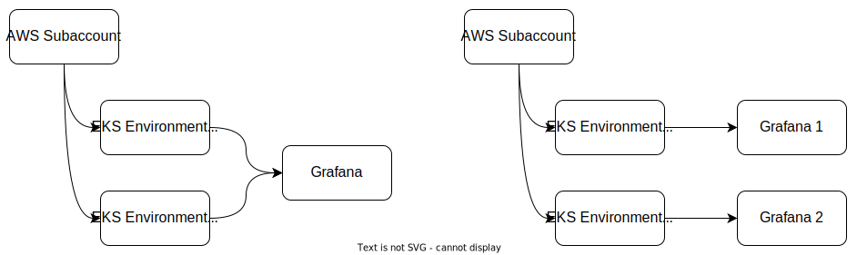

# Issue 1 / Week 45 / 2023

So let's kick start my new blog design with this first issue!

## Work

Generally, work has been great for me thus far, as I'm being able to return to my internship
workplace. I'm really grateful for all of my friends that allowed this to happen.

For the past weeks, I've been assigned to carry out the migration of Grafana Cloud stacks. For
context, in our place we have Grafana set up for clients separately from each other. However, the
Grafana is shared between multiple environments under the same client (e.g. Alice Dev and Alice
Prod). While this approach seemed to work initially, along the way we encountered several cases
where in one client environment, there could be multiple game studios. These game studios are
supposed only be able to access their own metrics and dashboards.

To address
this requirement, we are going to implement [label-based access
control](https://grafana.com/docs/enterprise-metrics/latest/tenant-management/lbac/) to isolate all
resources in Grafana based on their respective owner. However, as in a Grafana stack there could be
multiple client's environments, it's quite hard to implement LBAC for mixed environments. Because of
that, we are also going to reimplement the Grafana so that one Grafana will only be used for one
client environment (e.g. one Grafana for Alice Dev and other for Alice Prod).

<!--  -->
<!-- 
 -->
<!--   Left: Grafana subaccount-based Right: Grafana environment-based -->
<!-- 
 -->

<figure>
    
    

      <figcaption>
        Left: Subaccount-based. Right: Environment-based. Not sure why it was implemented that way initially
      </figcaption>
    

</figure>

Long story short, currently we tried to migrate one client environment to the new Grafana
implementations. We already did the data source and dashboard setup. From it we found that we need
to adjust dashboards' variables to suit the new implementation. My goal is to finalize the runbook
by next week so that we could start to implement this in other environments.

Oh also, I have my mentor (not sure what is the correct term we use here lol) exchanged, and it
seems our compatibility is pretty good, as I would like to learn to be a much active in tech
community from him. My vision has been rectified for the past few months by getting to know a lot of
amazing individuals on social media (Twitter mostly).

<!-- It *shouldn't* be our team but it is us that pushed this requirement lol -->

## Games

### War Thunder

This week War Thunder did their anniversary event. Finally I got to start researching the Panzerkampfwagen VIII, Maus. Although, I forgot to buy new vehicles as I just realized all of them were discounted 50 percent (should've bought Marder A1-). Another thing is that I started to know how to play light tanks/scout: push as far as you dare and PLEASE HAVE SOME TRIGGER DISCIPLINE. As light tank your main task is to scout enemy. Dealing damage isn't your priority. Let the Leos and T-55s did that for your team.

### League of Legends

South Korean Telecom 1. That's it. That's the entry.

  <blockquote class="twitter-tweet">
WHAT JUST HAPPENED <a href="https://twitter.com/hashtag/Worlds2023?src=hash&amp;ref_src=twsrc%5Etfw">#Worlds2023</a> <a href="https://t.co/pfuFBnDPma">pic.twitter.com/pfuFBnDPma</a>
&mdash; LoL Esports (@lolesports) <a href="https://twitter.com/lolesports/status/1723649549489799244?ref_src=twsrc%5Etfw">November 12, 2023</a></blockquote> 

<!-- <video> -->
<!--   <source src="https://fxtwitter.com/lolesports/status/1723649549489799244.mp4" type="video/mp4" -->
<!-- </video> -->
<!-- https://fxtwitter.com/lolesports/status/1723649549489799244 -->

### Granblue Fantasy Versus Rising

I got to test Granblue Fantasy Versus Rising. My thoughts after playing them for a while:

1. Pretty easy to learn. Four buttons FG, with specials only around 236X, 214X, 623X, with X being
   one of (L)ight, (M)edium, or (H)eavy buttons. Although, there are several char that have different
   specials.
2. I tried Gran (tutorial), Vaseraga, Yuel, Narmaya, and Anila. Vaseraga is slow, big buttons char like
   Nagoriyuki. Hard to start turn. Yuel is rushdown char like Giovanna. She got pretty annoying 214
   which could do mid (L, H) and low (M). Narmaya is quite unique as she got two "stances" which
   alters her buttons and specials. Anila is simpler one. She have Totsugeki-style moves.
3. Netcode is a bit hit or miss. I got low ping when playing with @kotakmakan. Otherwise I got
   pretty high latency. I suppose it's due to my opponent's network.

<figure>
    
    

      <figcaption>I have a lot of fun playing this game. Me waiting for @kotakmakan</figcaption>
    

</figure>

Will I buy it? Not sure for now. My free time is a little unpredictable. I mean, I try to spend my
money as wise as possible. So if I buy a game, I should get the most of it by playing it. Just
that thought alone made me think twice every time I want to buy something, with games included.

Thanks to @kotakmakan for spared his time to play with me. I have a lot to improve :3
